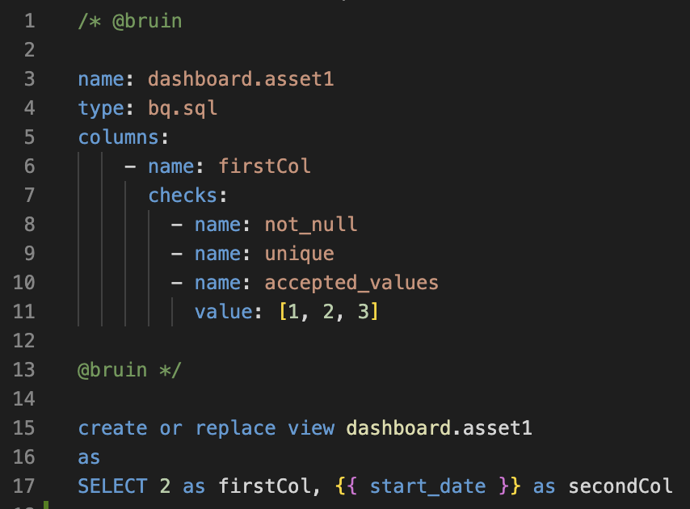

# Bruin

Bruin is a unified analytics platform that enables data professionals to work end-to-end for their data pipelines. This extension is built to improve the development experience of data products on Bruin using Visual Studio Code.

## Features

This is the first release of Bruin's VS Code extension, therefore it currently only support syntax highlighting for Bruin's syntax. We will be adding more features in the future.

## Release Notes

### 0.0.1

Initial release of syntax highlighting.